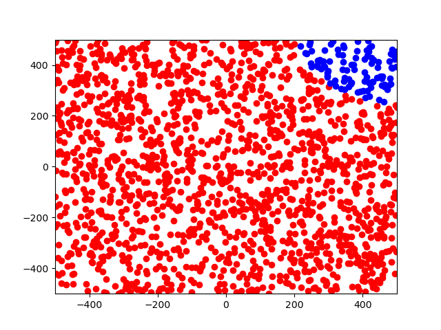
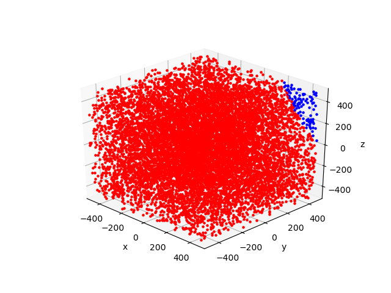
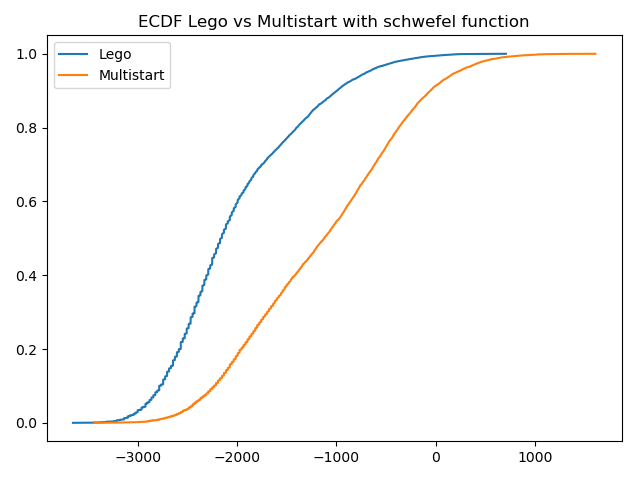

# LeGO: Learning Global Optimization

## Main Idea
Implementation of an Heuristic Method for **Global Optimization** based on the **Multistart** algorithm. Classic Multistart 
uniformly samples the feasible set and then starts a local search from each sampled point. The main idea of _Cassioli et 
al. [1]_ paper is to decide a _a priori_ whether a starting point is promising or not to make a specific local search
with a **SVM**.

In the initial phase, the framework collects results from a classical Multistart execution and generates a labeled **train set** 
(with a _threshold_). The Support Vector Machine is trained so that the algorithm becomes capable of distinguishing between promising points and points for which a refinement local search is not worth.

The experiments are performed on the **Rastrigin** and the **Schwefel** functions [2] and they are divided in two blocks:

- _Low dimensionality_ tests: to check if SVM detects the right initial points;
- _High dimensionality_ test (dim 10): ECDF printing and Multistart results comparison.

## Dependencies
The code has been developed and tested with:
- Python 3.7.6
- numpy 1.18.1
- matplotlib 3.2.0
- scikit-learn 0.22.2 (for SVM)
- scipy 1.4.1
- statsmodels 0.11.1(for ECDF)

## How Make it Work

- Run `lego.py` to perform low dimensionality test, fixing parameters. For 2-3 dim, program prints a view.
- Run `results.py` for high dimensionality test (ECDF).

## Results

Here se can see the 3 and 4-dimensional results for the Schwefel function and the related ECDF with dim 10. The global optimum is in (420.96, ..., 420.96), so we can see in 
the first and the second picture how SVM can detech worthy starting points. Moreover, the ECDF show how Lego finds better local optima than 
Multistart.

## References

[1] A. Cassioli, D. Di Lorenzo, M. Locatelli, F. Schoen, M. Sciandrone, _Machine Learning for Global Optimization_, https://www.researchgate.net/publication/227102777_Machine_Learning_for_Global_Optimization

[2] Pohlheim, H. _GEATbx Examples: Examples of Objective Functions (2005)._ Retrieved June 2013, from http://www.geatbx.com/download/GEATbx_ObjFunExpl_v37.pdf.
